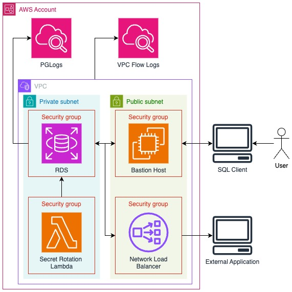

# Single Instance Secure RDS

**Important note:** Deploying this will cost you money. Parts of this deployment are not in the AWS free tier.

**Another important note:** Please check the `bin/single-instance-rds.ts` file to set the values you want. By default, the IP and KP name are dummy values and the deployment will fail unless you change it.

**And another one:** Usually, single instance DBs are not production recommended due to availability and
fault tolerance. Also, this uses a NAT instance instead of a NAT gateway for cost purposes.

## Summary

This repo deploys a secure RDS instance in a private subnet. Additionally, it sets up password rotations for the
root user. It also creates an EC2 bastion host to allow user queries via an SSH tunnel. Optionally, a network load 
balancer can be deployed for applications to query the instance.

If something can be KMS encrypted, it is KMS encrypted.

From a monitoring perspective, it provides a basic alarms on CPU usage, and free disk space in a CW dashboard. In
the same dashboard, the VPC flow logs and PostgreSQL logs are shown.

## Infrastructure

## Assumptions

- You know the instance size you need.
- You are ok with a single RDS instance and no read replica or fail-overs.
- You don't need a public endpoint (however, if you do, you can deploy the NLB).
- You have a fixed IP you will use to connect to the DB.

## Things This Doesn't Do

- Take action on the alarms.
- Deploy any actual database schemas, tables, etc.

## Considerations

* For someone to be able to successfully connect to the DB from outside the VPC, they would have to:
  * Have access to the secret in SM.
  * Make the request from the IP in the stack file.
  * Have access to the AWS console or CLI to CloudFormation or EC2 to get the bastion or NLB DNS.
  * Have access to the key pair for the bastion (doesn't apply if the NLB is used).
* JetBrains IDEs for example have the ability to connect to databases using the SSH tunnel, the end user experience is smooth after the setup.
* You can use the `example_sql_to_test.sql` file to play around after creating the DB.
* The bastion has no permissions to do anything that is not the tunnel, that is why it is on a public subnet with a public address.
* For cost purposes, a NAT instance is used instead of NAT gateways.